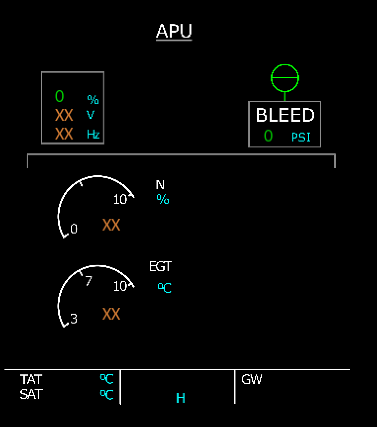
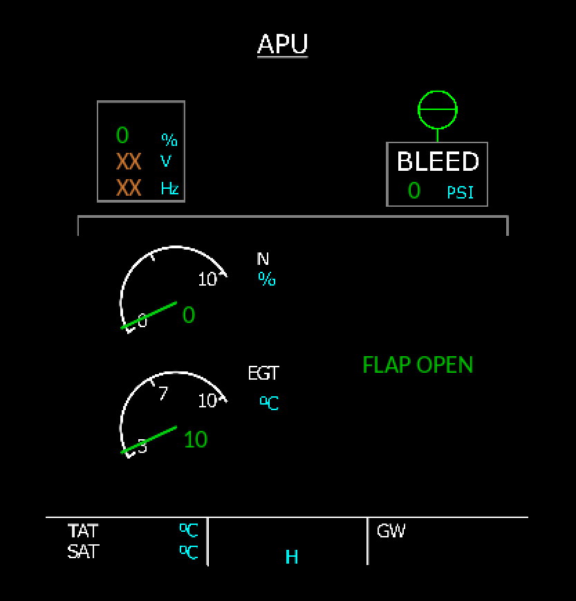
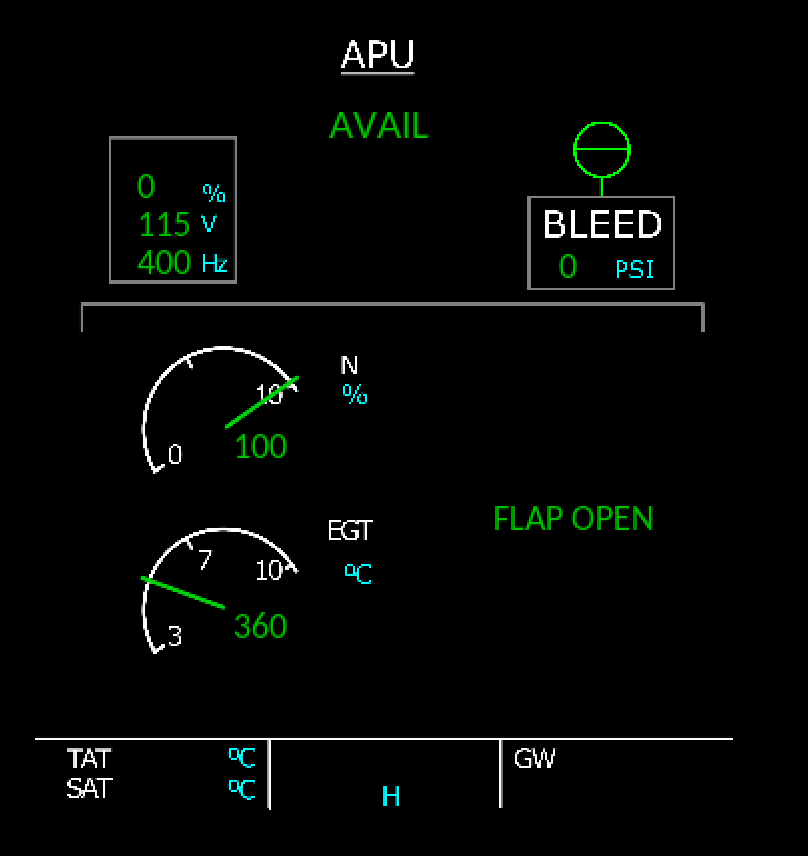
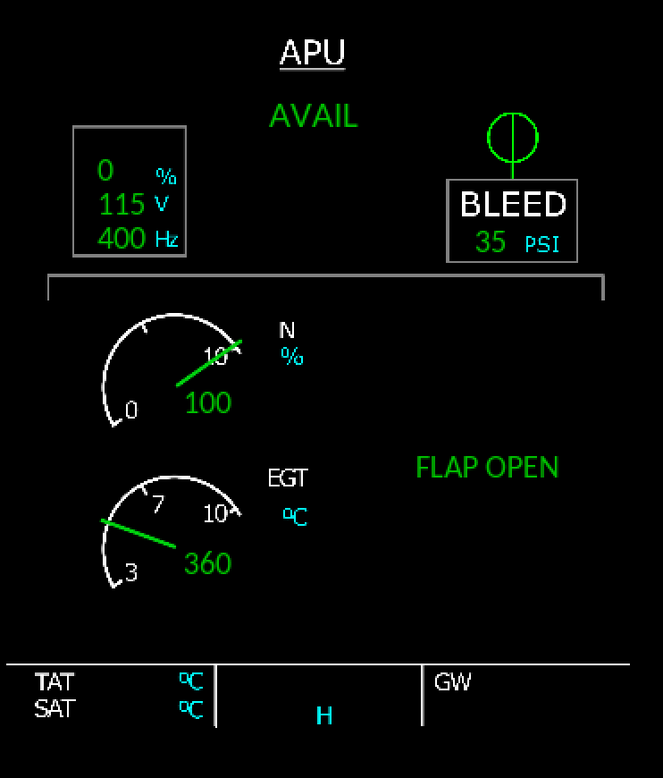

# Simavionics

A proof-of-concept to make an aircraft systems simulator in Go. 

This is work in progress. Do not expect any useful. 

## Usage

Currently, the PoC is comprised by three different programs:

- `a320sim`: The A320 aircraft simulator. 
- `a320cli`: The command line interface of the simulator
- `a320ecam`: the ECAM panel module to monitor the aircraft. 

At this point, only APU is simulated. The ECAM only shows the APU page. And the CLI only recognizes commands to manipulate the APU.

The three programs communicate through the network. By default, they bind and connect to `localhost`.

If the simulator is unavaiable, the rest of the program will work and will try to reconnect in a loop. Once the simulator is back to life, the programs will operate normally. 

## Build

Just do:

```
$ make all
```

...to build each program. 

## Run

Run the simulator first:

```
$ ./a320sim
15:38:52.243   bus.remote ▶ NOTI 001 Listening on tcp://localhost:7001
15:38:52.251     a320.apu ▶ NOTI 002 Starting a new APU System
```

Now run the ECAM:

```
$ ./a320ecam
15:39:33.311         ecam ▶ INFO 001 Initializing display
15:39:33.498         ecam ▶ INFO 002 Initializing SimAvionics remote bus
15:39:33.499   bus.remote ▶ NOTI 003 Dialing to tcp://localhost:7001
```

You will see a new window in your desktop with a ECAM panel showing the APU page for a cold-and-dark APU:



Now it is time to run the CLI:

```
$ ./a320cli
SimAvionics - A320 Systems Simulation
Copyright (C) 2018 Alvaro Polo

2020/11/13 15:41:42 The simulator is now online
> 
```

As you can see, the prompt is ready to accept commands. We will start by pressing the APU master button:

```
> apu master on
```

You will see in the ECAM that the numbers in the N and EGT gauges turn green. After a while, a `FLAP OPEN` message is displayed. 



Now it is time to press the APU start button from the CLI:

```
> apu start
```

You will see in the ECAM how N and EGT gauges respond accordingly. Some time after, the APU generator will activate and show 115 volts and 400 Hz. 



Now it's time to open the APU bleeding:

```
> apu bleed on
```

You will see how the ECAM reflects the action showing a bleed of 35 PSI. 



Finally, we can see what happens when the simulator stops. Just press CTRL+C in the console where `a320sim` is running.

After that, the ECAM page turns black. And a red rectangle blinks on the top left corner. This indicates the ECAM is not connected to the simulator. 


In the CLI, you can see also that the disconnection has been detected

```
2020/11/13 15:52:39 The simulator is now offline
>
```

And that's all! 

## Next steps

Well, this is just a PoC. If you are curious, have a look to the source code. And if you have any question or comment do not hesitate to contact. 

Many thanks for your attention!
